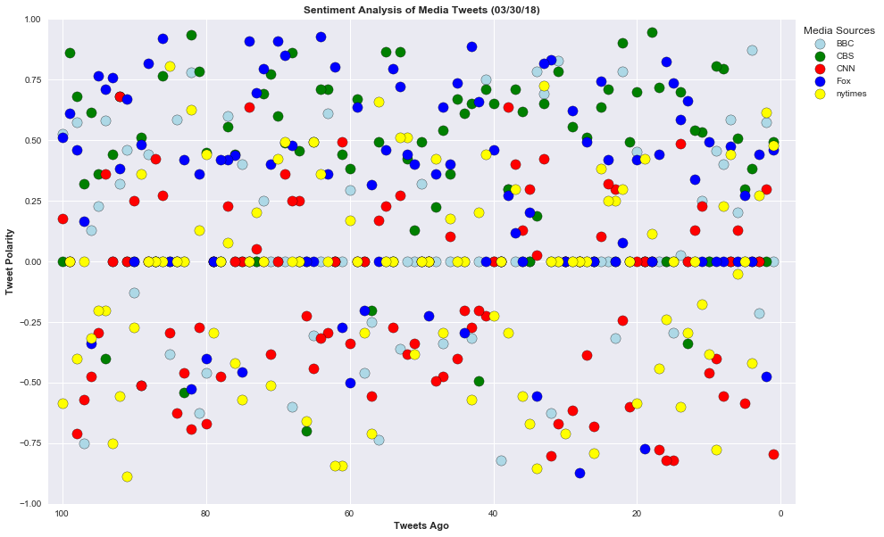
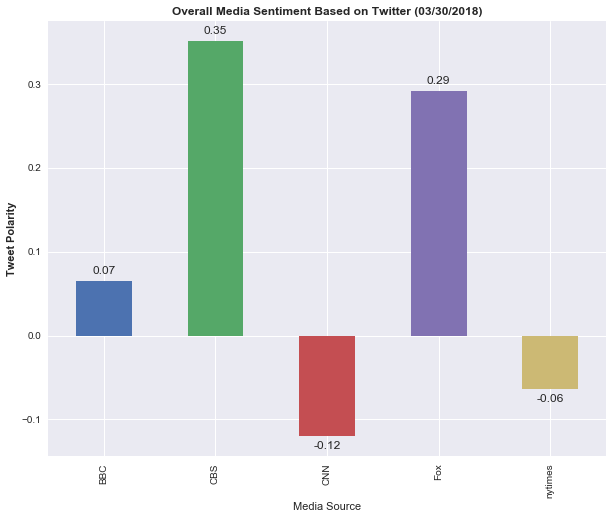

# News Mood - Distinguishing Sentiments

Created a Python script to perform a sentiment analysis of the Twitter activity of various news outlets, and to presented my findings visually.

Visualized summary of the sentiments expressed in Tweets sent out by the following news organizations: __BBC, CBS, CNN, Fox, and New York times__.

## Analyzes:

* Created a scatter plot of sentiments of the last __100__ tweets sent out by each news organization, ranging from -1.0 to 1.0, where a score of 0 expresses a neutral sentiment, -1 the most negative sentiment possible, and +1 the most positive sentiment possible.

* Created a bar plot visualizing the _overall_ sentiments of the last 100 tweets from each organization. For this plot, I aggregated the compound sentiments analyzed by VADER.

* Performed a sentiment analysis with the compound, positive, neutral, and negative scoring for each tweet. 

* Pulled into a DataFrame the tweet's source acount, its text, its date, and its compound, positive, neutral, and negative sentiment scores.

* Exported the data in the DataFrame into a CSV file.

* Saved PNG images for each plot.

## Applications & Tools:

tweepy, pandas, matplotlib, seaborn, textblob, and VADER.

Your final Jupyter notebook must:

# Results and Conclusions:

My final output provides a visualized summary of the sentiments expressed in Tweets sent out by the following news organizations: BBC, CBS, CNN, Fox, and New York Times.

The first plot features the following:

A scatter plot of sentiments of the last 100 tweets sent out by each news organization, ranging from -1.0 to 1.0, where a score of 0 expresses a neutral sentiment, -1 the most negative sentiment possible, and +1 the most positive sentiment possible. Each plot point reflects the compound sentiment of a tweet. Each plot point is sorted by its relative timestamp.

The second plot is a bar plot visualizing the overall sentiments of the last 100 tweets from each organization. I've aggregated the compound sentiments analyzed by VADER.

The final Jupyter notebook shows the following:

Pulls last 100 tweets from each outlet. Performs a sentiment analysis with the compound, positive, neutral, and negative scoring for each tweet. Pulls into a DataFrame the tweet's source acount, its text, its date, and its compound, positive, neutral, and negative sentiment scores. Exports the data in the DataFrame into a CSV file. Saves PNG images for each plot.

From the sentiment analysis results with the five media tweets on March 30, 2018, we can note that:

Overall sentiment polarity is positive for BBC, CBS and Fox tweets and negative for CNN and NY Times.

From the overall media sentiment based on tweets, CBS is most positive at 35% and Fox News is the second most positive with 29%.

The results also show that CNN is most negative with 12% negative polarity and NY Times is second with 6% negative polarity, which the closest to neutral.

